# The AppSec pipeline — where each control sits

Four pipelines, each owning a different layer. The point is not that scanners exist; it is that **each control sits at the earliest stage where it can still be cheap to fix**.

```mermaid
flowchart LR
  subgraph DEV["Develop"]
    A1[gitleaks<br/><i>secrets in source + history</i>]
    A2[Semgrep<br/><i>SAST — code flaws</i>]
    A3[Trivy fs<br/><i>SCA — dependencies</i>]
  end
  subgraph BUILD["Build"]
    B1[Trivy image<br/><i>OS + package CVEs</i>]
    B2[CycloneDX SBOM<br/><i>what shipped</i>]
    B3[Checkov + Trivy config<br/><i>IaC misconfiguration</i>]
  end
  subgraph DEPLOY["Deploy"]
    C1[Branch protection<br/>+ required checks]
    C2[Gatekeeper<br/><i>admission control</i>]
  end
  subgraph RUN["Run"]
    D1[OWASP ZAP<br/><i>DAST — running app</i>]
    D2[Log-based metric + alert<br/><i>anonymous bucket access</i>]
    D3[Cloud Audit Logs<br/><i>admin activity + data access</i>]
  end
  DEV --> BUILD --> DEPLOY --> RUN
```

| Stage | Control | Catches | Pipeline |
|---|---|---|---|
| Develop | **gitleaks** | Credentials in source *or history* | `appsec.yml` |
| Develop | **Semgrep** (SAST) | Injection, XSS, SSRF, deserialisation — *code*, not packages | `appsec.yml` |
| Develop | **Trivy fs** (SCA) | Vulnerable dependencies, surfaced in the PR | `appsec.yml` |
| Build | **Trivy image** | OS + package CVEs; gate **before** registry push | `app.yml` |
| Build | **CycloneDX SBOM** | Inventory of what shipped | `appsec.yml` |
| Build | **Checkov / Trivy config** | IaC misconfiguration before `apply` | `iac.yml` |
| Deploy | **Branch protection + required checks** | Unreviewed or unscanned code reaching `main` | GitHub |
| Deploy | **Gatekeeper** | New privileged workloads (admission-time) | `k8s/` |
| Run | **OWASP ZAP** (DAST) | What is actually exploitable on the deployed app | `dast.yml` |
| Run | **Log-based metric + Monitoring alert** | Anonymous access to the backup bucket | `terraform/security.tf` |
| Run | **Cloud Audit Logs** | Admin activity *and* data access across the project | `terraform/security.tf` |

## Why the layering matters
- **SAST ≠ SCA ≠ DAST.** Image scanning finds vulnerable *packages*; it says nothing about NodeGoat's injection flaws. Semgrep finds the code flaw; ZAP proves it is reachable on the deployed instance. Presenting any one of these as "AppSec" is the common mistake.
- **Cost of a fix rises by stage.** A secret caught by gitleaks pre-merge costs minutes; the same secret found in production costs a rotation, an incident, and an audit trail.
- **The same weakness, caught twice, at very different cost.** Checkov flags `allUsers` on the bucket *before* `apply` — a diff in a pull request. The log-based alert fires only once someone has anonymously read it — an alert at 3am, after the data has already moved.

## The honest limitation — and the argument it sets up
Every control above produces **its own list**. Ten Semgrep findings, forty Trivy CVEs, six Checkov misconfigurations, a Monitoring incident in a separate console. All ranked by their own severity scale, none aware of the others.

None of them can say: *this* dependency CVE is in *this* image, running in a pod bound to **cluster-admin**, behind an **internet-facing** load balancer, next to a VM whose service account holds **`roles/editor`**, with the database backups **already public**.

That correlation — code finding → running cloud context → exploitable path — is precisely the gap a CNAPP fills, and the reason prioritisation beats enumeration. **Fifty findings is not a security programme; one ranked attack path is.**
