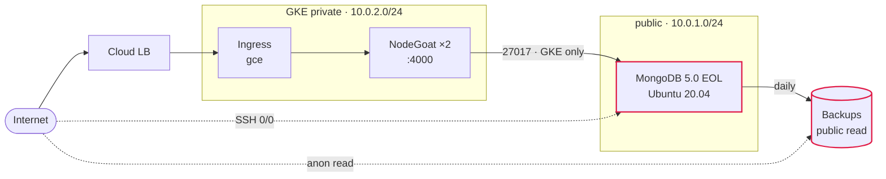

# What the exercise asked for

- A **deliberately vulnerable** two-tier app on Kubernetes
- **Everything as code** — no click-ops
- **Cloud-native controls** — one preventative, one detective
- **Security in the pipeline** — scan before deploy
- **Prove it live** — `kubectl`, the file in the container, real data

The weaknesses are **requirements**, not accidents. {.punch}

<!--
Land the last line deliberately. Five weaknesses, chosen so they compose into a
single path rather than sitting as five unrelated tickets — that composition is
the whole argument of the deck, and it starts here.

If asked why NodeGoat rather than the sample todo app: a clean app gives the
scanners nothing to find, and a pipeline reporting "all clear" demonstrates
nothing.
-->

---
layout: default
---

# What I built

OpenTofu · OWASP NodeGoat from Artifact Registry · four GitHub Actions pipelines {.aside}

<!--
Walk the solid arrows first — that is the intended path a user takes. Then the
two dotted ones, which are the unintended paths: SSH open to the world, and
anonymous read on the backup bucket.

Red outline = deliberately weak. Everything else is a genuine control: the
Mongo VM is firewalled to the GKE ranges only, auth IS required, GKE nodes are
private. Worth saying, or the environment reads as uniformly careless rather
than deliberately weak in five specific places.
-->
