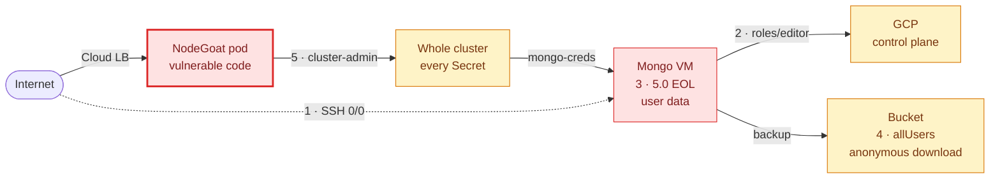

# Why this costs money before anyone is breached

::left::

### What the business gets

- The product itself — user accounts and financial data
- Change velocity that survives review
- A **known supply chain** — SBOM per build
- Reproducible; RPO ≤ 24 h
- Auditable from day one

::right::

### Where a flaw is caught

| Caught | Costs |
|---|---|
| In the pull request | a review comment |
| At build or admission | a rebuild |
| In production | rotation · IR · customer comms |

A gate that blocks **without answering** gets routed around. {.punch}

<!--
- the app IS the product. the data is the business. everything else here exists to keep it available and keep it private.

- the table on the right is the whole economic argument, and it needs no invented numbers: pull request      → a review comment build / admission → a rebuild, nobody outside sees it production        → rotation, IR, customer comms, a notification decision

- supply chain: an SBOM per build means "what are we running, and what's inside it" is a QUERY, not an excavation — afternoon vs. fortnight when the next Log4Shell lands

- last line: adoption is a design constraint, not a rollout problem a gate people route around — exception, bypass flag, second pipeline — has already failed, however good its findings are
-->

---
layout: two-cols-header
---

# Disclosure, not downtime

This is not an outage you roll back. {.lede}

::left::

### The exposure

- Backup bucket: `allUsers` **read + list**
- No exploit. No credential. No login.
- GDPR Art. 33 — a 72-hour notification decision
- Privilege concentrated in **two identities**

::right::

### The cost of an unranked list

- Five tools. Five lists. Five scales.
- **None knows the others exist**
- Triage spent on findings nobody can reach

Mongo requires auth and is firewalled to the GKE ranges · nodes are private · no credentials in the repo {.aside}

<!--
- this is the failure you don't roll back. you can redeploy an outage. you can't un-disclose data.

- the bucket is the sharpest version of it: same data as the database, different control set, quieter owner
- enumerate and download — no exploit, no credential, no login

- privilege sits in exactly two identities: one pod SA, one VM SA
- compromise either and it's the whole cluster, or the whole project
- blast radius is a COMMERCIAL measure — how much of the business one bad afternoon reaches

- right side: five tools, five lists, five scales, none aware of the others
- the cost isn't the findings — it's triage spent on things nobody can reach

- read the grey line at the bottom out loud — otherwise this sounds like a uniformly careless environment instead of five deliberate holes

#### If asked

- **GDPR specifics?** — *Art. 33 isn't automatic notification. it's a 72-hour clock on a DECISION: assess whether it's likely to risk data subjects' rights and freedoms, notify if yes, document the reasoning if no. either way somebody decides, on a deadline.*
- **DORA / NIS2?** — *ICT-risk management, third-party and supply-chain security, incident reporting — with management bodies accountable for the measures. an SBOM stops being paperwork the moment someone has to answer "which of our systems contained that library".*
-->

---
layout: default
---

# Five findings. One attack path.

Five routine tickets. Five different owners. One chain. {.punch}

<!--
This is the slide everything else is built around, so I'll go slowly.

Start on the left, because this is the part I think people get backwards.
The entry point is application code. Not a firewall rule, not a bucket — the
app. That's what's internet-facing, and that's what has the flaws.

From there it's three steps. The pod's service account is bound to
cluster-admin, so anything executing in that container can read every Secret
in the cluster — including the Mongo credentials. Those credentials open a
database running an end-of-life version. And that VM's own service account
holds roles/editor, which is the cloud control plane.

There's a second route that needs none of that. The database backs itself up
every night into a bucket that grants allUsers read and list. You enumerate
it, and you download it.

Now the part that matters. Individually, these are five routine tickets. A
role binding. A version pin. An IAM role. A bucket ACL. A firewall rule. Plus
"the application has findings", which every application has. Five different
owners — app team, platform, database, cloud, data. Not one of them would page
anybody at three in the morning.

Chained, it's a single path from a line of application code to the cluster, to
the data, and to the cloud control plane.

#### If asked

- **which would you fix first?** — *honestly: the ordering only exists once you can see the path. that's two slides away and it's the whole argument for a graph. I'd rather not pre-empt it.*
- **is the Mongo firewall not enough?** — *it is doing its job — Mongo is reachable only from the GKE ranges. that's exactly WHY the chain runs through the application: from the internet, the pod is the only route to that credential.*
-->

---
layout: default
---

# Who catches each one

| # | Finding | Caught by |
|---|---|---|
| — | Application code + dependencies | Semgrep · Trivy fs |
| — | Internet-facing, unauthenticated | ZAP, on the running app |
| 5 | Pod SA bound to `cluster-admin` | Gatekeeper — only for the *next* pod |
| 3 | MongoDB 5.0, EOL, unpatched | lifecycle check — **which I had to add** |
| 2 | VM SA holds `roles/editor` | Checkov · Cloud Audit Logs |
| 4 | Bucket grants `allUsers` | Checkov · log-based alert |
| 1 | SSH `0.0.0.0/0` | Checkov — but no host logs shipped, so nothing watches its *use* |

Every tool owns one column. **None of them owns the chain.** {.punch}

<!--
- don't read the table. point at the third column.

- AppSec tooling owns the FRONT of the chain
- IaC scanning and cloud logging own the BACK
- nothing owns the middle, and nothing owns the whole

- row 3 is the honest one — originally nothing here caught it at all I added the lifecycle check. that story's two slides away.

#### If asked

- **why is the SSH row so thin?** — *Checkov flags the rule fine. nothing watches whether anyone USES it, because no host logs are shipped. real gap, not a demo shortcut.*
- **Gatekeeper only helps the "next" pod?** — *right. admission control acts at create time. it can't retro-fix the binding that already exists — which is deliberate here, because the existing weaknesses have to survive for the detective demo.*
-->
